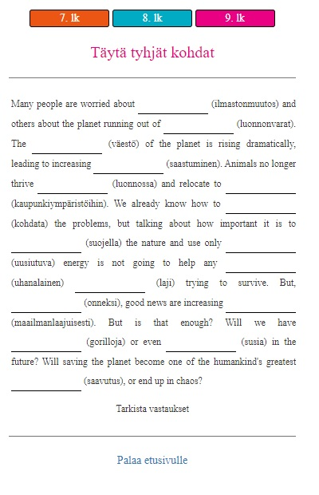

+++
author = "PJMM"
title = "Verkkosivun taustaa"
date = "2022-08-05"
type = "post"
tags = [
    "verkkosivu",
    "offtopic",
    "koodaus",
    "tietotekniikka",
    ]
categories = [
    "Verkkosivu",
]
+++

Tässä julkaisussa käsitellään tämän verkkosivun taustalla olevaa prosessia, joka on tietysti kokoajan kesken. Ehkä saat tästä inspiraatiota oman projektin luomiseen, tosin tuskin tämä kovin montaa ihmistä kiinnostaa. Oikeasti kirjoitan tätä koska harjoittelen alustan toimintoja ja formaatteja ja pääsen käymään läpi sivuston eri vaiheita.

## Miksi?

Taustalla on jo pitkään jatkunut halu tehdä jotain hyödyllistä tietoteknistä projektia, sillä kiinnostusta löytyy, mutta päämäärää ei. Töissä tuli vastaan aito tarve luoda omia verkkotehtäviä, jonka takia tämä projekti sai alkunsa. Lopulta syntyi tämä sivu. Tärkein syy kuitenkin on päästä viettämään aikaa omien kiinnostuksen kohteiden kanssa, minkä takia kaikki sisältö täällä ei välttämättä ole lukijan mielestä kovin hyödyllistä. Tämä sivu on tehty 95% itseäni varten, ja loput 5% teitä lukijoita varten, jos teitä edes on.

## Koodaustausta

Yläaste-lukioikäisenä tein nettisivut muistaakseni Microsoft Frontpagen avulla. Sivut laitettiin jollekkin ilmaispalvelimelle ja perään tietty .tk-domain. Sivustoja kertyi vuosien mittaan useita, mutta sisältöä ei ollut juurikaan. Ainakin yhdellä sivulla oli musta tausta, ja itse sivu toimi inline-framen avulla. Nykyistä sivua luodessa sain selville, että inline-framet ovat olleet vanhanaikaista koodia jo yli kymmenen vuotta, joten hyväksi koettu ulkoasu piti hylätä. Koodaustaustaa siis oli, mutta lähes olemattomasti. HTML ja CSS oli sillä tasolla että osasin hyvin lukea sitä, mutta tuottaminen vaati apukeinoja, sama siis kuin saksan kieli osaamiseni. Javascript-osaaminen käytännössä oli tasolla 0/5, nyt jo 1/5 jos pyöristää ylöspäin.

## Alkuvaiheet

idea sivusta oli hautunut päässä jo hetken, mutta alkoi konkretisoitua uudenvuodenaaton aikoihin vuoden 2020 vaihtuessa vuoteen 2021, paikkana Utajärveläinen sauna. Kysyin koodausta työksi tekevältä ystävältä millä koodikielillä yksinkertaiset verkkokielioppitehtävät kannattaisi toteuttaa, ja vastaus oli HTML ja Javascript. Rehellisesti sanottuna odotin jotain hienompaa, mutta eipä niitä muita tarvita (paitsi tietysti CSS). Kotiin päästyäni latasin [Notepad++](https://notepad-plus-plus.org/), jolla koodia osaavat tekivät nettisivuja joskus aikoinaan. Palvelimeksi valikoitui [GitHub Pages](https://pages.github.com/), joka on alustana tälläkin hetkellä (tilanne v. 2022). 

Tarkoituksena oli luoda monivalintatehtäväketju, jossa piti valita annettuun lauseesen oikea verbimuoto. Mikäli vastasit kysymykseen oikein, pääsit seuraavaan kysymykseen. Mikäli vastasit väärin, jouduit alottamaan koko homman alusta. Se, miksi tällainen tehtävä oli luotava oli se, että yläkoulun oppimateriaaleissa (SanomaPron On the Go) oli tarjolla huono määrä kielioppimateriaalia. Tarvetta oli yksinkertaisille behavioristisille tehtäville, joissa oppilas laittaa 30 verbin perään s-päätteen mikäli verbi sen vaatii. Virheen jälkeen palattiin takaisin alkuun koska muuten keskittymiskyvyttömät vaan arvailisi ne sinne ajattelematta yhtään enempää. Ja koska jotkut silti vastailisivat ajattelematta yhtään sen enempää, joku ehkä alintajuntaisesti oppisi jotain kun painelisi ne verbit sinne tarpeeksi monta kertaa. 

Koska Javascript-osaamista ei ollut, piti googlettaa. Googlesta löytyi nopea ohjeistus siitä miten tehdään Javascriptillä monivaiheinen monivalintehtävä, joten kopioin sen ja aloin muokkaamaan. Muokkaamisessa apun toimi [jsfiddle](https://jsfiddle.net/), jossa voit pyörittää HTML, JS ja CSS reaaliajassa. Rehellisesti sanottuna tein tuota ensimmäistä tehtävää noin yhdeksän tuntia, ja seuraavana päivänä saman verran kun korjasin virheet ja loin sen ympärille ulkoasun. Valmista tehtävää ja kaunista ulkoasua tuli ihasteltua pitkään, vaikka myöhemmin koko ulkoasu heitettiin menemään koska oli ruma ja epäkäytännöllinen ja Javascriptissä osa kohdista oli ihan järjettömiä. Alla kuva jsfiddlestä valmiin tehtävän jälkeen.



Koodin kanssa auttaneet kaverit epäilivät koko tehtävän alusta asti alkamisen olevan bugi eikä toiminto jonka rakentamiseen olin käyttänyt monta tuntia. Tehtävää tunnilla hyödyntäessä paikalla ollut erityisopettaja kehui erityisesti sitä toimintoa, joten taas huomaa eron pedagogisten asiantuntijoiden ja tavallisten ihmisten välillä. Samanlaisia tehtäviä tuli tehtyä muutama ja niitä käytettyä esimerkiksi tukiopetuksen lopussa ja ennen koetta kerratessa. Tehtävässä oli myös havaittavissa pelillistämistä (joka on ehdottomasti pöhinäsana), sillä seiskaluokkalainen kuvaili erästä tehtävää että "tuo on aivan paska peli". 

Seuraavaksi tehtävätyypiksi tein avoimen aukkotehtävän (alla) käyttäen hyvin pitkälti samoja menetelmiä kuin yllä.



Koulullamme oli myös liikkuvaan opiskeluun kannustava päivä, jolloin jokaisen opettajan tuli päivän aikana käyttää jotakin liikkuvaan opiskeluun kannustavaa menetelmää. Tein verkkotehtävän joka toimi suunnistuksen lailla. Opiskelijoille annettiin kysymys, ja tekstikenttään oikean vastauksen annettuaan he pääsivät seuraavaan vaiheeseen. Kysymyksistä osaan löytyi vastaus ainoastaan koulurakennuksen sisällä liikkuessa (esim. portaiden laskeminen) ja osa kysymyksistä oli kappaleen sanastoa.

## Seuraava vaihe

Lukuvuoden lähestyttyä loppua olin jo päättänyt että seuraavat lukuvuodet vietetään taas lukiossa. Sen takia en enää keskittynyt kesän aikana verkkosivun sisällön luomiseen, vaan aloin luomaan uutta käyttöjärjestelmää. Aiemmin jokainen sivu koostui omasta .html-tiedostosta, johon oli upotettu javascript ja css omien tägiensä sisään. Jos halusin liikuttaa jotain viivaa ulkoasussa, se piti tehdä manuaalisesti jokaisella sivulla erikseen. Siirsin ulkoasun omaan .css-tiedostoon, mutta sitten ei enää jaksanut, vaan aloin etsimään muita vaihtoehtoja. Lisäksi tarvittiin monipuolisempi käyttöliittymä, sillä yläkoulussa tehtäviä tehtiin puhelimella, mutta lukiossa käytössä on tietokoneet. Lisäksi lukiolaisille olisi mahdollisuus tuottaa myös muuta sisältöä, koska on oletus että ainakin muutamaa heistä voisi jopa kiinnostaa asia enemmän. 

Koodissa aiemmin auttanut henkilö mainitsi että hänellä oli myös oma verkkosivu GitHub-pagesissa, ja sivua tutkittuani huomasin, että se oli tehty [html5up.net](https://html5up.net/) valmispohjaan. Kokeilin sitä ja totesin että silti todella paljon muokattavaa. Sitten tutkin sivua vielä enemmän ja huomasin että se oli tehty [Jekyll](https://jekyllrb.com/)-nimisellä sivustogeneraattorilla. Yritin myös luoda samanlaista sivua, mutta en saanut toimimaan, enkä vieläkään tiedä miksi.

Kun Jekyll ei toiminut, heitin Googleen Jekyll alternatives. Sieltä tuli vastaan samalla periaattella toimiva [Hugo](https://gohugo.io/), joka on käytössä edelleen. Hugo toimii niin, että ohjelmisto luo valmiin verkkosivun sille syötetyistä palasista. Palaset voit tehdä itse tai sitten ladata valmiit palaset netistä. Omat palaseni hankin rakentamalla oman sivun [Future Imperfect](https://github.com/jpescador/hugo-future-imperfect) teeman ympärille. Se on yksi niistä html5up.net-teemoista, jonka jpescador-niminen käyttäjä on muokanut Hugo-yhteensopivaksi. Syksy meni verkkosivua rakentaessa ja ulkoasua hioessa, lukion ykkösten kanssa käytettiin epäsäännöllisten verbien harjoitteluun tarkoitettuja tehtäviä. Enimmäkseen hioin ulkoasua. Valmiiksihiotusta ulkoasusta ei ole valitettavasti laittaa kuvaa, sillä meni hermot ja poistin koko sivun koska en ole tyytyväinen mihinkään.



Sivusto rakentuu helposti Hugolla. Rakentamisen voi automatisoida [GitHub Actionsin](https://github.com/features/actions) avulla, mutta jostain syystä tiettyjä css-muutoksia ei saa läpi ilman että antaa Hugon rakentaa sivun omalla koneella. Tämänkin asian selvittämiseen meni se viitisen tuntia. 

## Nykytilanne

Reilun tauon jälkeen palasin sivuston pariin, sillä tehtäviä oli saatava. Ulkoasu meni kokonaan uusiksi, ja teemaksi valikoitui [Blonde](https://github.com/opera7133/Blonde). Uusia tehtävätyyppejä tuli, vanhojen tehtävien koodia parannettiin huomattavasti, sillä nyt oli jo sen verran ymmärrystä asian suhteen, että pystyi huomaamaan aiemmat järjettömyydet. Esimerkiksi väärästä vastauksesta aiempi tehtävä sammutettiin sleep();-komennolla, ja päälle tuli modal-ikkuna. Molemmat turhia. Ajasta kuitenkin 95% meni käyttöliittymän hiomiseen, sillä olen sellainen ihminen joka leikkaa reunoja täydellisen suoriksi niin kauan ettei leikattavaa ole enää jäljellä. Teemaan on lisätty esim. dropdown-valikot (meni monta päivää), uusi fontti (viitisen tuntia, en tiedä miksi) ja viimeisimpänä tätä kirjoitusta kirjoittaessa kuvien zoomaaminen klikkaamalla (meni myös viitisen tuntia koska en osaa lukea). 
